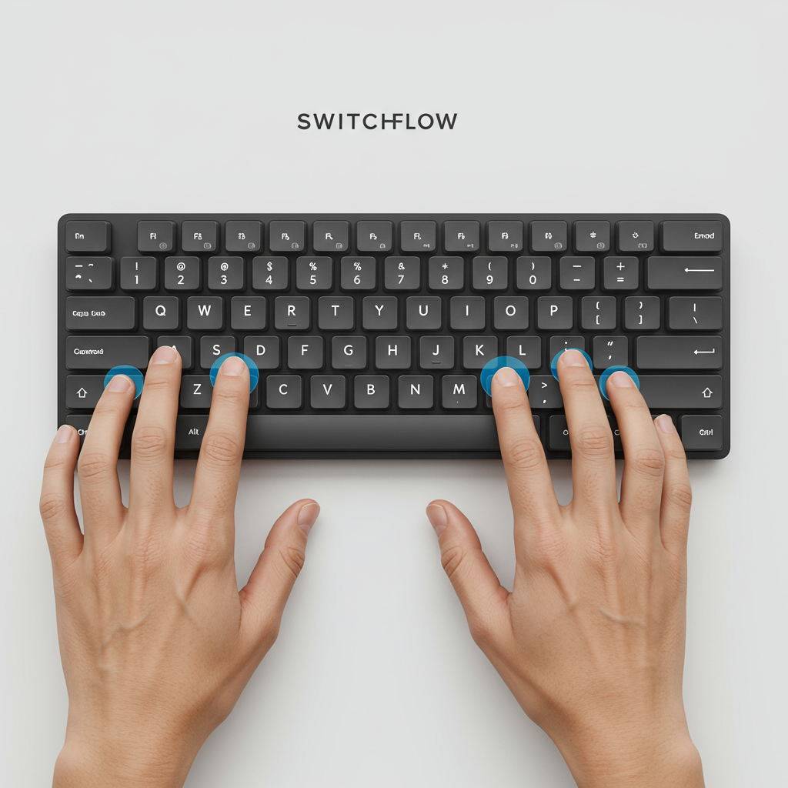

<p align="center">
  
</p>

# SwitchFlow - macOS Window Switching with reasonable defaults

This repository contains configuration files and scripts for managing windows on macOS using [yabai][gh-yabai] and [skhd][gh-skhd], along with custom scripts for enhanced workflow.

## About SwitchFlow

SwitchFlow is designed for macOS users who prioritize **speed and efficiency** in navigating between applications, aiming to provide the fastest possible way to switch contexts. Unlike traditional window or tiling managers, SwitchFlow takes a different approach:

- **Fixed Paths to Apps:** The core idea is to establish a fixed, muscle-memory shortcut for each application. This moves away from dynamic window management, focusing instead on direct, instantaneous access to your tools.
- **Optimized for Single Monitor, Fullscreen Apps:** SwitchFlow is intentionally designed and optimized for a workflow where you typically have one monitor and one application running fullscreen at any given time. This approach is deliberate to reduce visual clutter and information overload, promoting focused work.
- **Avoiding Visual Clutter:** By having dedicated shortcuts and predictable placements, SwitchFlow helps reduce visual clutter and the cognitive load associated with managing multiple windows.
- **No macOS Spaces Support:** A deliberate design choice is to **not** utilize macOS Spaces (virtual desktops). While Spaces can be useful for some workflows, they are often buggy, require disabling System Integrity Protection (SIP) for full `yabai` integration, and tend to break with every macOS release. By ditching Spaces, SwitchFlow leverages the stable and reliable core functionalities of `yabai` and `skhd`, ensuring a more consistent and robust experience across macOS updates.
- **Multi-Monitor Compatibility:** While the project is primarily developed and tested on a single-monitor setup, it _should_ function with multi-monitor configurations. However, multi-monitor behavior has not been extensively tested.
- **Speed Over Management:** This project is not about tiling windows or complex window arrangements. It's about minimizing the time spent on window management altogether, providing a direct and fast path to the application you need, when you need it.

## Features
**Sane keyboard setup based on the concept of home row**

Left Hand Hotkeys (cmd + lshift + key):
  - `1`, `2`, `3`
  - `q`, `w`, `e`
  - `a`, `s`, `d`

Right Hand Hotkeys (cmd + lshift + key):
  - `7`, `8`, `9`
  - `u`, `i`, `o`
  - `j`, `k`, `l`

**Intelligent Window Focusing:** Scripts to focus specific applications or cycle through windows based on application name and title prefixes.

**Chrome Profile Management:** Scripts to open Chrome with specific profiles and window names, optionally loading bookmarks from a folder.

## Grayscale Toggle

This feature automatically adjusts your macOS display to grayscale or color based on the application you are focusing, driven by your `skhd` hotkeys.

**How it Works:**

- When you use the `cmd + lshift - 1` hotkey (or any hotkey configured as "1" in `skhdrc`) to focus an application that is listed under the "1" hotkey in your `config.json`, the display will switch to **color** (grayscale off).
- For all other hotkeys, or when focusing any application not configured under the "1" hotkey, the display will switch to **grayscale**.

**Configuration:**
To enable or disable this feature globally, add the `"enable_grayscale_toggle"` key to your `~/.config/switch-flow/config.json` file:

```json
{
  "profiles": {
    /* ... */
  },
  "window_focus": {
    /* ... */
  },
  "enable_grayscale_toggle": true // Set to `true` to enable, `false` to disable
}
```

If `"enable_grayscale_toggle"` is set to `false` or is not present in `config.json`, the grayscale toggling functionality will be entirely disabled.

## Prerequisites

- macOS (tested on Sequoia)
- Homebrew (will be installed by `install.sh` if not present)

## Installation

1. **Clone the repository:**

   ```bash
   git clone git@github.com:kmiterror/switch-flow.git
   cd switch-flow
   ```

2. **Run the installation script:**

   ```bash
   ./install.sh
   ```

   The script will:
   - Install Homebrew (if not already installed).
   - Install `yabai`, `skhd`, `jq`, and `flock` via Homebrew.
   - Create necessary directories (`~/.config/yabai`, `~/.config/skhd`, `~/.local/bin/scripts`, `~/.config/switch-flow`).
   - Symlink the configuration files (`.yabairc`, `.skhdrc`) and scripts to their appropriate locations.
   - Make all scripts executable.
   - Copy example configuration templates to `~/.config/switch-flow`.
   - Start `yabai` and `skhd` services.

3. Manual Post-Installation Steps (CRITICAL!):

   After running `install.sh`, you **must** perform the following manual step:

   Go to `System Settings > Privacy & Security > Accessibility`.
   Add `yabai` and `skhd` to the list and ensure their checkboxes are enabled.
   You might need to restart your computer for these changes to take full effect.

## Optional Customization

Your primary configuration for `SwitchFlow` is managed in `~/.config/switch-flow/config.json`. This file allows you to define Chrome profiles, window focus hotkeys, and optional window placement rules.

**`config.json`:**
**`window_placement` values:**
These values, found within `window_focus` entries, define how a newly created window for a specific application should be automatically positioned on the screen. This is an **optional** setting. The format is `<rows>:<cols>:<start-x>:<start-y>:<width>:<height>`.
 * `rows`: Total number of rows in the grid.
 * `cols`: Total number of columns in the grid.
 * `start-x`: The starting column index (0-based).
 * `start-y`: The starting row index (0-based).
 * `width`: How many columns the window spans.
 * `height`: How many rows the window spans.

For example, `"1:2:0:0:2:1"` means a grid of 1 row and 2 columns, starting at column 0, row 0, spanning 2 columns and 1 row.

To help configure your Chrome profiles, run the `list-chrome-profiles.sh` script directly from the repository directory:
```bash
./list-chrome-profiles.sh
```
The values that you will see should be placed in config.json in the section:
```
  "profiles": {
    "personalProfile": "Profile 1",
    "workProfile": "Default"
  }
```
later you can specify what url on what profile will be opened by specific key.
Mind that `cmd+shift+p` is responsible for opening all the Chrome windows defined in config.json file.

## Usage

Once installed and configured, your hotkeys (as defined in `~/.skhdrc`) will be active. The default keybindings are designed for efficient, homerow-based access:

**Left Hand Hotkeys (cmd + lshift + key):**
- `1`, `2`, `3`
- `q`, `w`, `e`
- `a`, `s`, `d`

**Right Hand Hotkeys (cmd + lshift + key):**
- `7`, `8`, `9`
- `u`, `i`, `o`
- `j`, `k`, `l`

These hotkeys are used to trigger the `cycle_focus_window.sh` script, which intelligently focuses or launches applications based on your `config.json` setup.

## Troubleshooting

- **Scripts not running:** Ensure `yabai` and `skhd` have Accessibility permissions and that `~/.local/bin` is in your `PATH`.
- **Window focusing issues:** Check the logs in `/tmp/focus_window_script.log`.
- **Chrome not opening correctly:** Verify `~/.config/switch-flow/chrome_profiles.conf` and the arguments passed to `open_chrome.sh`.

## Contributing

Feel free to fork, modify, and contribute to this project.

## Credits
Thank you to [@koekeishiya][gh-koekeishiya] for creating [yabai][gh-yabai] and [skhd][gh-skhd].

<!-- Links to other GitHub projects/users -->
[gh-skhd]: https://github.com/koekeishiya/skhd
[gh-yabai]: https://github.com/koekeishiya/yabai
[gh-koekeishiya]: https://github.com/koekeishiya
